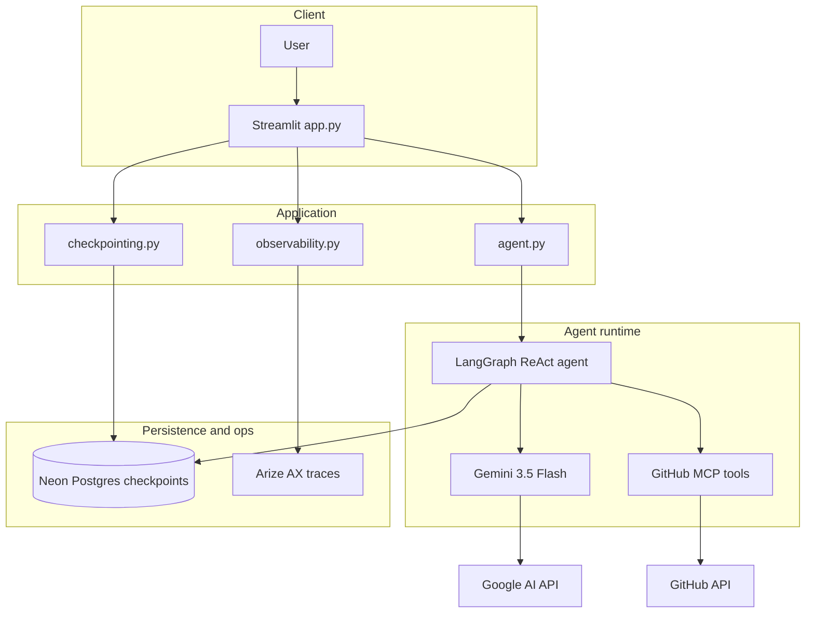
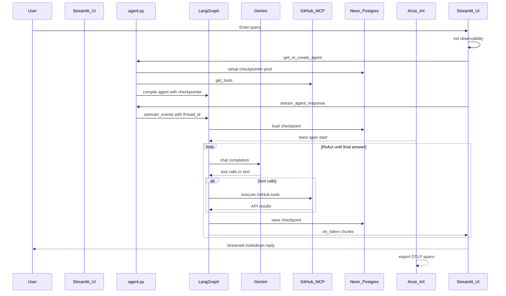

# GitHub Intelligence Agent

Research anything on GitHub through natural language. Ask questions in plain English; a LangGraph ReAct agent plans tool calls, queries GitHub via the official MCP server, and streams answers back—backed by Gemini, durable conversation state in Neon Postgres, and optional tracing in Arize AX.

## Objective

Build an **agentic GitHub research assistant** that:

- Discovers repos, users, issues, PRs, code, and trends without manual API wrangling
- Uses **GitHub Copilot MCP** for full API access through dynamically discovered tools
- Keeps **multi-turn context** in Postgres (not just in the browser)
- Exposes a simple **Streamlit chat UI** for interactive use
- Supports **production observability** (OpenTelemetry → Arize AX)

## Tech stack

| Layer | Technology |
|--------|------------|
| UI | [Streamlit](https://streamlit.io/) |
| Agent framework | [LangChain](https://www.langchain.com/) + [LangGraph](https://www.langchain.com/langgraph) (`create_agent`, ReAct loop) |
| LLM | [Google Gemini](https://ai.google.dev/) (`gemini-3.5-flash` via `langchain-google-genai`) |
| GitHub access | [GitHub Copilot MCP](https://api.githubcopilot.com/mcp/) (`langchain-mcp-adapters`) |
| Conversation state | [LangGraph Postgres checkpointer](https://pypi.org/project/langgraph-checkpoint-postgres/) + [Neon](https://neon.tech/) |
| Observability | [Arize AX](https://arize.com/) (`arize-otel`, `openinference-instrumentation-langchain`) |
| Runtime | Python 3.11–3.13, [uv](https://docs.astral.sh/uv/) |

## High-level architecture



### Repository layout

| File | Role |
|------|------|
| [`app.py`](app.py) | Streamlit UI, session cache, async event loop, chat streaming |
| [`agent.py`](agent.py) | Agent factory, MCP client, streaming helpers, system prompt |
| [`checkpointing.py`](checkpointing.py) | Neon connection pool + `AsyncPostgresSaver` setup |
| [`observability.py`](observability.py) | Arize OTel registration + LangChain instrumentation |
| [`tests/`](tests/) | Unit tests (credentials, chunks, observability, checkpointing) |

## Query → response flow

End-to-end path when a user sends a message in the UI:

1. **Streamlit** appends the user message and calls `stream_agent_response`.
2. **Agent** is built once per session (cached) with MCP tools and a Postgres checkpointer.
3. **LangGraph** loads prior state for `thread_id`, runs the ReAct loop (model ↔ tools).
4. **Gemini** decides whether to answer or call GitHub MCP tools.
5. **MCP** executes GitHub API operations; results return to the model.
6. **Tokens** stream to the UI via `astream_events` callbacks.
7. **Checkpointer** writes graph state to Neon after each step.
8. **Arize** (if configured) records spans for the run.



## Usage

### Prerequisites

- Python 3.11+
- [uv](https://docs.astral.sh/uv/getting-started/installation/)
- [GitHub PAT](https://github.com/settings/tokens) (read access is enough for many queries)
- [Google AI API key](https://aistudio.google.com/apikey)
- [Neon](https://neon.tech/) database (`DATABASE_URL`)
- Optional: [Arize AX](https://arize.com/) `ARIZE_SPACE_ID` + `ARIZE_API_KEY`

### Setup

```bash
git clone https://github.com/ankurdhuriya/gitHub-intelligence-agent.git
cd gitHub-intelligence-agent
uv sync
cp .env.example .env
# Edit .env with your secrets
```

### Environment variables

See [`.env.example`](.env.example):

| Variable | Required | Description |
|----------|----------|-------------|
| `GITHUB_PAT` | Yes | GitHub Personal Access Token for MCP |
| `GOOGLE_API_KEY` | Yes | Gemini API key |
| `DATABASE_URL` | Yes | Neon Postgres connection string |
| `ARIZE_SPACE_ID` | No | Arize space ID for tracing |
| `ARIZE_API_KEY` | No | Arize API key for tracing |
| `ARIZE_PROJECT_NAME` | No | Project name in Arize (default: `github-intelligence-agent`) |

### Run the app

```bash
uv run streamlit run app.py
```

Open the local URL (default `http://localhost:8501`). Use the chat input or sidebar presets, then watch the assistant stream tool status and the final answer.

### Tests and lint

```bash
uv run pytest
uv run ruff check .
uv run ruff format --check .
```

## Checkpointing (Neon)

LangGraph stores conversation state under a **`thread_id`** (default: `streamlit_session_thread`). Tables include `checkpoints`, `checkpoint_blobs`, and `checkpoint_writes`.

Example: list recent checkpoints in the Neon SQL editor:

```sql
SELECT checkpoint_id, checkpoint->'updated_channels' AS updated
FROM checkpoints
WHERE thread_id = 'streamlit_session_thread'
ORDER BY checkpoint_id DESC
LIMIT 10;
```

Clearing the UI chat does **not** delete Postgres history unless you delete rows or use a new `thread_id`.

## Observability (Arize AX)

When `ARIZE_SPACE_ID` and `ARIZE_API_KEY` are set, [`observability.py`](observability.py) registers OTLP export and instruments LangChain **before** agent imports. View traces in your Arize project (`ARIZE_PROJECT_NAME`).

## Future work

- [ ] **Per-session `thread_id`** — isolate conversations per Streamlit session instead of one shared thread
- [ ] **Clear Postgres on “Clear conversation”** — wipe checkpoint rows for the active thread from the UI
- [ ] **MCP reconnect** — sidebar action to rebuild the agent when the MCP connection goes stale
- [ ] **Deploy** — containerize Streamlit; use Neon pooled URL and secrets manager in production
- [ ] **Auth** — gate the UI or map users to distinct `thread_id`s
- [ ] **Evals** — golden datasets in Arize Phoenix for regression on GitHub Q&A quality
- [ ] **README / CI** — document required GitHub Actions secrets (`GITHUB_PAT`, `GOOGLE_API_KEY`, optional Arize)

## License

This project is licensed under the [Apache License 2.0](LICENSE).
